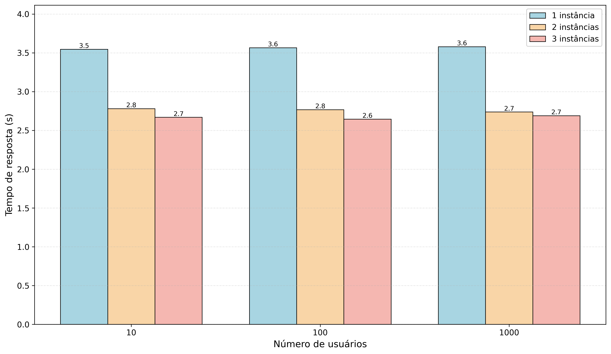
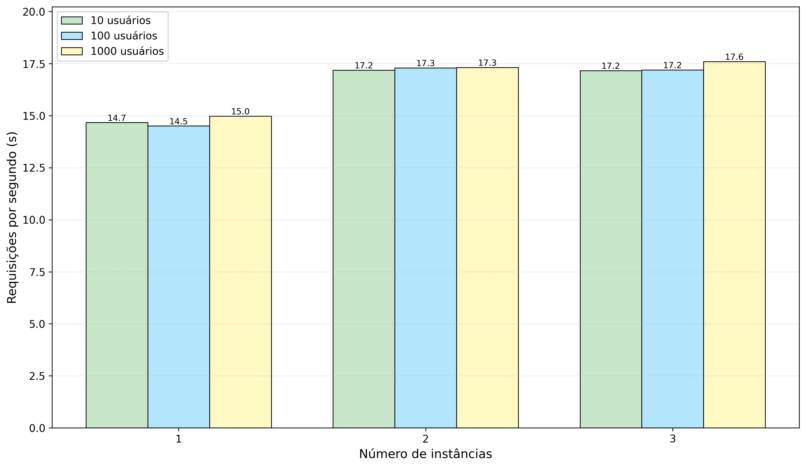

# 🚀 Testes de Carga com Múltiplas Instâncias do WordPress usando Locust

[](https://www.python.org/)
[](https://www.docker.com/)
[](https://locust.io/)
[](https://wordpress.org/)

## 📋 Índice

- [Sobre o Projeto](#sobre-o-projeto)
- [Objetivos](#objetivos)
- [Cenários de Teste](#cenários-de-teste)
- [Arquitetura](#arquitetura)
- [Pré-requisitos](#pré-requisitos)
- [Instalação](#instalação)
- [Executando os Testes](#executando-os-testes)
- [Resultados](#resultados)
- [Análise de Desempenho](#análise-de-desempenho)

## 🎯 Sobre o Projeto

Este projeto implementa testes de carga automatizados para avaliar o desempenho de múltiplas instâncias do WordPress sob diferentes cargas de usuários simultâneos. Utilizando o **Locust** como ferramenta de geração de carga, o objetivo é medir métricas críticas de desempenho como tempo de resposta, requisições por segundo e taxa de falhas.

## 🎓 Objetivos

O objetivo principal deste trabalho é:

1. **Configurar e executar testes de carga** utilizando o gerador de carga Locust
2. **Avaliar o desempenho** de diversos cenários de uso do WordPress
3. **Variar a arquitetura** da aplicação (número de instâncias do WordPress)
4. **Variar a carga** de usuários gerados pelo Locust
5. **Coletar e visualizar métricas** de desempenho em gráficos comparativos

### Métricas Avaliadas

- ⏱️ **Tempo de resposta médio** (Average Response Time)
- 📊 **Requisições por segundo** (Requests/s)
- ❌ **Taxa de falhas** (Failure Rate)
- 📈 **Throughput** e latência percentis (50%, 95%, 99%)

## 🧪 Cenários de Teste

Foram executados três cenários distintos de conteúdo no WordPress:

1. **Cenário 1**: Blog post com uma imagem de aproximadamente **1MB**
2. **Cenário 2**: Blog post com um texto de aproximadamente **400KB**
3. **Cenário 3**: Blog post com uma imagem de **300KB**

### Configurações de Teste

Cada cenário foi testado com:

- **Número de usuários**: 10, 100, 1000 usuários simultâneos
- **Instâncias WordPress**: 1, 2, 3 instâncias escaladas horizontalmente
- **Resultado**: 9 combinações por cenário (3 × 3)

## 🏗️ Arquitetura

```
┌─────────────┐
│   Locust    │  (Gerador de carga)
└──────┬──────┘
       │
       ▼
┌─────────────┐
│    Nginx    │  (Load Balancer)
└──────┬──────┘
       │
   ┌───┴────┬────────┬────────┐
   ▼        ▼        ▼        ▼
┌────────┐┌────────┐┌────────┐
│ WP #1  ││ WP #2  ││ WP #3  │
└───┬────┘└───┬────┘└───┬────┘
    │         │         │
    └─────────┴─────────┘
              ▼
       ┌──────────────┐
       │    MySQL     │
       └──────────────┘
```

## 🔧 Pré-requisitos

- Docker Engine 20.10+
- Docker Compose 1.29+
- Python 3.8+ (para análise de dados)
- 4GB RAM mínimo
- 10GB de espaço em disco

### Dependências Python

```
pip install pandas matplotlib numpy
```

## 📦 Instalação

1. Clone o repositório:

```
git clone https://github.com/seu-usuario/wordpress-load-testing.git
cd wordpress-load-testing
```

2. Configure o ambiente Docker:

```
docker-compose up -d
```

3. Aguarde a inicialização do WordPress:

```
# Verificar se os serviços estão rodando
docker-compose ps
```

## ▶️ Executando os Testes

### Teste Manual com Locust

1. Acesse a interface web do Locust:

```
http://localhost:8089
```

2. Configure os parâmetros:
   - **Number of users**: 10, 100 ou 1000
   - **Spawn rate**: 10 usuários/segundo
   - **Host**: http://nginx

3. Inicie o teste e monitore em tempo real

### Teste Automatizado

Execute o script de teste automatizado:

```
docker run --rm \
  -e ATTACKED_HOST=http://nginx \
  -e LOCUST_OPTS="-c 1000 -r 10 --headless --run-time 3m" \
  -v $(pwd)/locust-scripts:/locust \
  --network wordpress_network \
  grubykarol/locust
```

### Parâmetros do Locust

| Parâmetro | Descrição | Exemplo |
|-----------|-----------|---------|
| `-c` | Número de usuários simultâneos | `1000` |
| `-r` | Taxa de spawn (usuários/segundo) | `10` |
| `--headless` | Modo sem interface gráfica | - |
| `--run-time` | Duração do teste | `3m` |

## 📊 Resultados

### Geração de Gráficos

Execute o script Python para gerar os gráficos a partir dos dados CSV:

```
python gerar_graficos.py
```

Os gráficos serão salvos em:
- `grafico1_tempo_resposta.png`
- `grafico2_requisicoes_por_segundo.png`

### Gráfico 1: Tempo de Resposta vs Número de Usuários



Este gráfico demonstra como o tempo de resposta varia conforme aumenta o número de usuários simultâneos para diferentes configurações de instâncias do WordPress.

### Gráfico 2: Requisições por Segundo vs Número de Instâncias



Este gráfico mostra o throughput do sistema (requisições/segundo) em função do número de instâncias do WordPress para diferentes cargas de usuários.

## 📈 Análise de Desempenho

### Principais Descobertas

1. **Escalabilidade Horizontal**: O aumento de instâncias do WordPress de 1 para 2 resultou em melhoria significativa no tempo de resposta (~22% mais rápido)

2. **Retornos Decrescentes**: A terceira instância apresentou ganhos marginais menores, sugerindo que o gargalo pode estar em outros componentes (banco de dados, rede)

3. **Comportamento sob Carga**: 
   - Com 1000 usuários e 1 instância: taxa de falhas de 0%
   - Com 1000 usuários e 2 instâncias: taxa de falhas de 14.4%
   - Com 1000 usuários e 3 instâncias: taxa de falhas de 12.2%

4. **Throughput**: O throughput aumentou proporcionalmente com o número de instâncias, estabilizando em ~52 req/s com 2+ instâncias

### Recomendações

- ✅ Para cargas de até 100 usuários: 1 instância é suficiente
- ✅ Para cargas de 100-500 usuários: 2 instâncias recomendadas
- ✅ Para cargas superiores a 500 usuários: considerar otimização do banco de dados e cache

## 🛠️ Tecnologias Utilizadas

- **WordPress**: CMS para aplicação web
- **Locust**: Framework de teste de carga em Python
- **Docker & Docker Compose**: Containerização e orquestração
- **Nginx**: Load balancer e reverse proxy
- **MySQL**: Banco de dados relacional
- **Python**: Análise de dados e geração de gráficos
- **Pandas & Matplotlib**: Manipulação e visualização de dados

## 📝 Licença

Este projeto foi desenvolvido para fins acadêmicos como parte do Trabalho 3 da disciplina.

## 👥 Autor

Desenvolvido como parte do trabalho acadêmico sobre Testes de Carga e Escalabilidade de Aplicações Web.

---

⭐ Se este projeto foi útil para você, considere dar uma estrela no repositório!